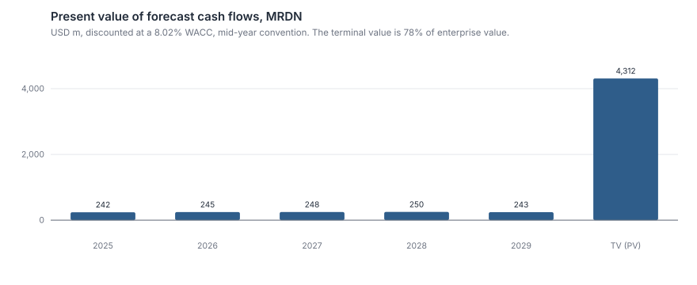
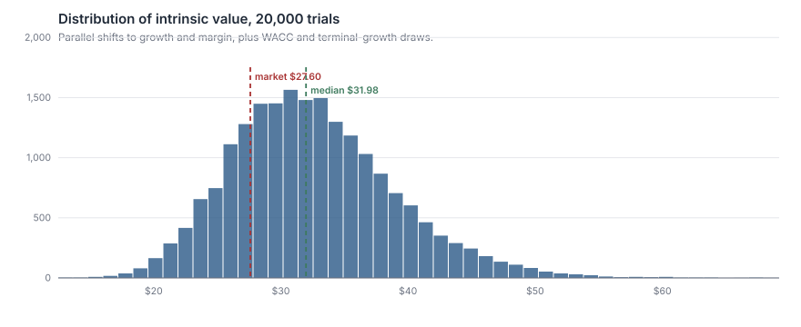
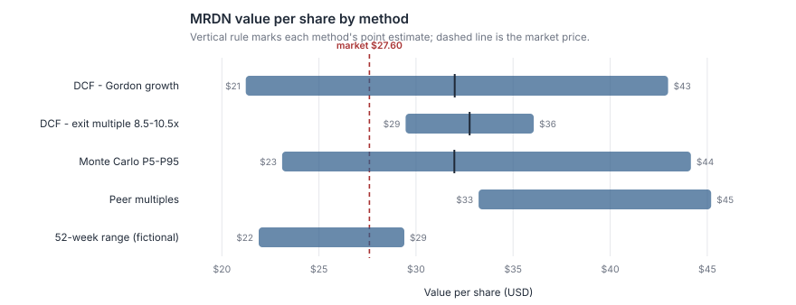

# Equity Valuation — Discounted Cash Flow

**What is Meridian Beverage Group worth per share, and what does the market price already assume?**

A full FCFF discounted cash flow with a bottom-up WACC, two independent terminal-value
methods that cross-check each other, scenario and Monte Carlo analysis, a reverse DCF,
and a trading-comparables sanity check — about 700 lines of standard-library Python,
no dependencies, one command to reproduce every number below.

```bash
python analysis.py        # writes outputs/results.md and four figures
python -m unittest discover tests -v
```

> **Data notice.** Meridian Beverage Group (MRDN) and its two peers are **fictional
> companies**. Their accounts are generated from explicit operating drivers by
> [`data/README.md`](data/README.md) → `build_statements.py`, and the generator refuses to
> emit a year whose balance sheet does not tie to the cent. The reason is in
> [Limitations](#limitations); the short version is that inventing a plausible company is
> honest, while retyping a real issuer's filings from memory is not. Everything in the
> method transfers to a real 10-K by replacing one file.

---

## 1. The question

Meridian is a mid-cap premium soft-drinks business. Between FY2019 and FY2024 it did
something specific and awkward: it grew revenue 41%, watched gross margin collapse from
41.2% to 36.1% in the FY2022 input-cost spike, bought a brand for $430m with borrowed
money at the worst possible moment, and then spent two years repairing both the margin
and the balance sheet. By FY2024 EBIT margin is back to 10.5% — better than the trough,
still short of the 13.2% it earned in FY2021.

The stock trades at $27.60, or 19.1× trailing earnings and 10.2× EV/EBITDA, against a
larger peer on 23.0× and 14.6×.

So: **is the discount deserved?** Concretely —

1. What is the business worth on its own cash flows, independent of what it trades at?
2. What growth and margin path does $27.60 already embed?
3. How wide is the range of defensible answers, and what drives the width?

Question 2 is the one that decides anything. A DCF alone tells you what your assumptions
are worth, which is a fact about you. The gap between your assumptions and the market's
is a fact about the opportunity.

## 2. Methodology

### 2.1 Why unlevered free cash flow

The model discounts **free cash flow to the firm** at the WACC rather than free cash flow
to equity at the cost of equity. Meridian's leverage moved from 0.9× net debt/EBITDA to
3.7× and back to 2.1× inside three years. Under FCFE that swing distorts the cash flow
being forecast; under FCFF it lands in the discount rate, where it belongs and where it
can be held at a target structure.

```
FCFF = EBIT × (1 − t) + D&A − capex − ΔNWC
```

### 2.2 Cost of capital — bottom-up, not regressed

| Input | Value | How it was set |
| :--- | ---: | :--- |
| Risk-free rate | 4.10% | 10-year government yield |
| Equity risk premium | 5.00% | mature-market implied ERP |
| Unlevered beta | 0.72 | sector (beverages/staples), bottom-up |
| Levered beta | 0.89 | Hamada: βL = βU × (1 + (1−t)·D/E) |
| Size premium | 0.50% | mid-cap illiquidity adjustment |
| **Cost of equity** | **9.03%** | CAPM |
| Pre-tax cost of debt | 6.14% | FY24 interest expense ÷ average total debt |
| After-tax cost of debt | 4.68% | at the 23.9% effective rate |
| Equity / debt weights | 76.8% / 23.2% | market values |
| **WACC** | **8.02%** | |

A regression beta on a single mid-cap's own stock typically carries a standard error wide
enough to move the valuation by double digits, and it silently embeds whatever leverage
the company happened to run during the estimation window. A sector unlevered beta,
relevered at the structure the WACC weights actually assume, is both tighter and
internally consistent. The cost of debt is taken from what Meridian *pays* — FY24
interest expense over average drawn debt — rather than from a ratings grid, because the
revolver draw makes its marginal cost observable.

### 2.3 The forecast

Five explicit years, then a terminal value. Drivers are set in `analysis.py` where a
reader can change them:

| FY | Revenue growth | EBIT margin | D&A % rev | Capex % rev |
| :--- | ---: | ---: | ---: | ---: |
| 2025 | 5.0% | 10.9% | 5.0% | 5.2% |
| 2026 | 4.6% | 11.3% | 4.9% | 5.1% |
| 2027 | 4.2% | 11.6% | 4.8% | 4.9% |
| 2028 | 3.8% | 11.8% | 4.8% | 4.7% |
| 2029 | 3.5% | 11.9% | 4.7% | 4.6% |

Three deliberate choices:

- **Margin recovers, but not all the way.** The path ends at 11.9%, below the 13.2% of
  FY2021. Part of the FY2022 damage was cyclical input costs, which have reversed; part
  was mix, and the acquired brand carries a lower margin. Assuming a full round-trip to
  the prior peak is the most common way a beverage DCF flatters itself.
- **Capex converges toward D&A.** Growth capex during the integration phase falls back
  toward maintenance levels. Capex permanently below D&A is a liquidating business, not a
  cheap one.
- **Working capital is a real cost of growth.** ΔNWC is the historical NWC/revenue ratio
  (averaged across FY19–FY24, so the FY2022 inventory build does not become a permanent
  assumption) applied to *incremental* revenue. Ignoring it would add roughly $1 per share
  of fictitious value.

Cash flows are discounted with the **mid-year convention** — cash arrives through the
year, not in a lump on 31 December.

### 2.4 Two terminal values, each checking the other

The terminal value is ~78% of enterprise value. That is normal, and it is also why
quoting one terminal method is not enough. The model runs both and reports what each
implies about the other:

- Gordon growth at 2.25% (below long-run nominal GDP — a company growing faster than the
  economy forever eventually becomes the economy) → **implies a 9.3× exit EBITDA multiple**
- Exit multiple at 9.5× EBITDA → **implies 2.38% terminal growth**

Both cross-checks land in a defensible place. If Gordon at 2.25% had implied a 16× exit
multiple, one of the two assumptions would be wrong, and the model would be saying so.

## 3. Results

### 3.1 Value bridge

| Component | Gordon growth | Exit multiple |
| :--- | ---: | ---: |
| PV of explicit forecast (FY25–29) | 1,229 | 1,229 |
| PV of terminal value | 4,312 | 4,421 |
| Terminal share of EV | 77.8% | 78.2% |
| Enterprise value | 5,541 | 5,650 |
| Less net debt | (1,030) | (1,030) |
| Equity value | 4,511 | 4,620 |
| Diluted shares (m) | 141.0 | 141.0 |
| **Value per share** | **$31.99** | **$32.76** |

Against a market price of **$27.60**: **+16% to +19%**.



### 3.2 The reverse DCF — the result that matters

Holding the margin path, working-capital intensity and terminal growth fixed, and solving
for the uniform revenue growth rate that makes the DCF return exactly $27.60:

> **The market price implies 0.45% annual revenue growth through FY2029.**

Meridian grew 4.7% in FY2024 and 11.6% in FY2023. For the current price to be right, the
business must be within a rounding error of ex-growth — while retaining the FY24 margin
that the same price apparently accepts. That is an internally strange combination, and it
is the strongest argument in this note that the discount is too large.

### 3.3 Scenarios

| Scenario | Growth shift | Margin shift | Terminal g | Value / share | vs price | Prob. |
| :--- | ---: | ---: | ---: | ---: | ---: | ---: |
| Bear | −2.2% | −1.7% | 1.50% | $21.23 | −23.1% | 25% |
| Base | — | — | 2.25% | $31.99 | +15.9% | 50% |
| Bull | +1.8% | +1.4% | 2.75% | $42.99 | +55.7% | 25% |

Probability-weighted: **$32.05**, or +16.1%.

The bear case is not a stress test of the balance sheet — it is a normalised-margin case
in which the FY22 damage proves structural rather than cyclical. That is the actual
investment risk, and it costs 23% from here.

### 3.4 Distribution of outcomes



20,000 trials, drawing parallel shifts to growth (σ = 1.5pp) and margin (σ = 1.1pp)
alongside WACC (σ = 0.6pp) and terminal growth (σ = 0.35pp):

| P5 | P25 | Median | P75 | P95 | P(value > price) |
| ---: | ---: | ---: | ---: | ---: | ---: |
| $23.11 | $28.01 | $31.98 | $36.41 | $44.16 | **77.4%** |

Growth and margin are shifted *in parallel across all five years* rather than drawn
independently per year. Analysts are wrong about the level of a company's trajectory far
more often than about one year in isolation; independent yearly draws would average out
and understate the true spread by a wide margin.

### 3.5 Sensitivity and the comps cross-check



WACC × terminal growth is the standard grid, and it is standard because it dominates
everything else: ±1pp of WACC moves the value roughly ±$8, more than the entire bear-to-base
gap. Full grids in [`outputs/results.md`](outputs/results.md).

| Peer median multiple | Level | Peers used | Implied MRDN value |
| :--- | ---: | ---: | ---: |
| EV/EBITDA | 14.6× | 1 | $42.91 |
| EV/Sales | 2.30× | 2 | $45.20 |
| P/E | 23.0× | 1 | $33.22 |

VSSL is excluded from the EBITDA and earnings medians: its EBITDA is barely positive, so
its EV/EBITDA prints at 158.9× — arithmetic, not information. What is left is essentially
one peer, and the write-up says so rather than dressing a single observation up as a
median. Note also that comps sit *above* the DCF here: Calder earns a 17.9% EBIT margin
against Meridian's 10.5% and carries a third of the leverage, so applying its multiple
unadjusted would be an error in Meridian's favour. **The DCF is the primary answer; the
comps only establish that it is not obviously too high.**

## 4. Conclusion

Meridian is worth roughly **$32 per share** against a $27.60 price — a 16% discount that
narrows to 12% on the bear-weighted average and survives every terminal-method
cross-check. The case does not rest on heroic assumptions: it rests on the observation
that the market is pricing 0.45% growth into a business that grew 4.7% last year and has
already repaired two-thirds of its margin damage.

The case against is leverage, not valuation. Net debt/EBITDA of 2.1× is manageable, but
$330m of it sits on a revolver that has grown every year since the acquisition while term
debt was being repaid — the deleveraging is partly presentational. At the bear-case
margin the multiple does not re-rate and the balance sheet stops being a footnote.

**Position: modest upside, sized accordingly.** A 16% discount is not a margin of safety
in a levered mid-cap; it is a reason to own it small, and to treat the FY25 gross margin
print as the falsification test.

## Limitations

Honest limitations, not decorative ones.

1. **The company is fictional.** Every method, line of code and cross-check is real, but
   the numbers describe an invented issuer. This is a deliberate trade: reproducing a real
   10-K from memory risks a wrong number presented as a real one, which is worse than no
   number at all, and redistributing vendor fundamentals is a licensing problem. Swapping
   in a real company means replacing `data/financials.json`; no analysis code changes.
2. **78% of the value is terminal.** True of nearly every DCF of a going concern, and the
   reason both terminal methods are run against each other — but it means this is
   fundamentally a bet on a perpetuity assumption, dressed in five years of detail.
3. **The peer set is two companies, one of which is unusable.** Not a peer set. A real
   one needs 8–12 names with a documented selection rule.
4. **Beta is asserted, not estimated.** The bottom-up beta of 0.72 is a sector judgement
   with no regression behind it here, because the fictional company has no price history.
   With real data this should be a regression on 5–8 unlevered peer betas, reported with
   its dispersion.
5. **The Monte Carlo assumes independent draws across the four risk factors.** In
   reality, WACC rises when growth expectations fall; ignoring that correlation makes the
   distribution wider than it should be in the middle and narrower in the tails.
6. **No dilution from share-based compensation, no operating leases capitalised, no
   pension deficit, no minority interests.** Each is standard in a real bridge; each is
   absent from the fictional accounts and would need adding for a live name.
7. **One analyst, no review.** The scenario probabilities (25/50/25) are a judgement with
   nothing behind them but symmetry.

## Repository layout

```
analysis.py                    one command, reproduces everything
src/dcf.py                     WACC, FCFF forecast, terminal value, reverse DCF, Monte Carlo
src/comps.py                   trading comparables with a not-meaningful screen
src/finlib.py                  shared statistics and SVG charting toolkit
data/financials.json           fictional three-statement history (see data/README.md)
report/research-note.md        the two-page note a portfolio manager would actually read
outputs/                       generated tables and figures — safe to delete and rebuild
tests/                         unit tests for the valuation maths
```

## Method references

Damodaran, *Investment Valuation*, 3rd ed. — bottom-up betas, terminal value discipline.
Koller, Goedhart & Wessels, *Valuation* (McKinsey), 7th ed. — FCFF construction, ROIC
and reinvestment framing.
