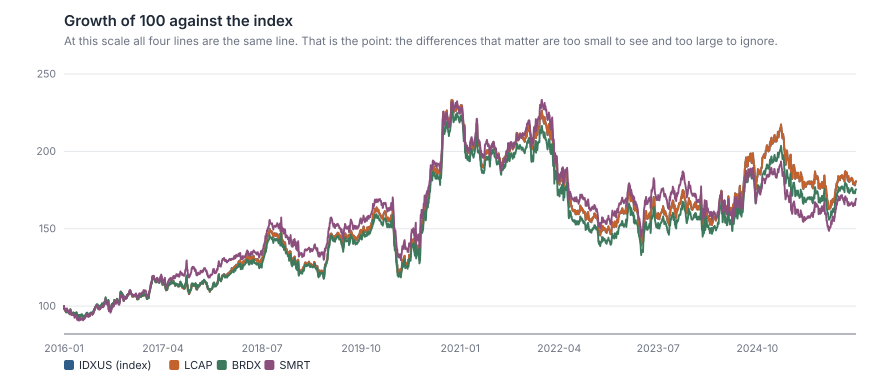
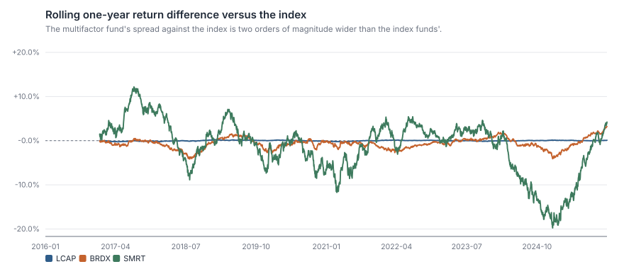
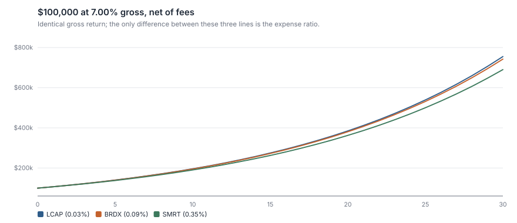
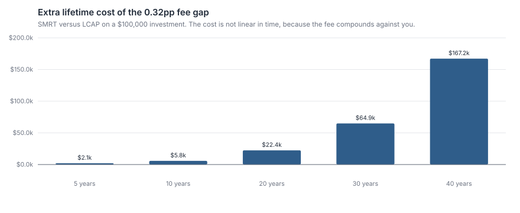
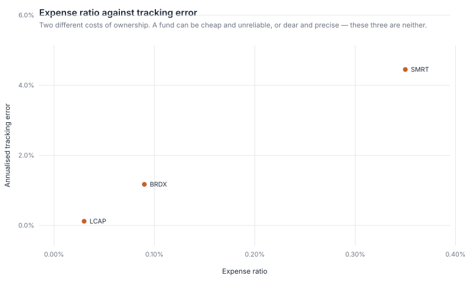

# ETF Cost & Tracking Study

**Three funds track roughly the same market. One charges 0.03%, one 0.09%, one 0.35%. Over thirty years the gap between the cheapest and the dearest is $64,886 on a $100,000 investment — 8.6% of the final balance, paid whether the fund performs or not.**

A study of what index funds actually cost to own, separating the two things a fund
comparison usually blurs together: how much return the fund gives up (**tracking
difference**) and how reliably it gives up that amount (**tracking error**).

```bash
python analysis.py        # writes outputs/results.md and six figures
python -m unittest discover tests -v
```

> **Data notice.** The price history is a **simulation** in which funds are modelled
> explicitly as their index minus an expense ratio plus tracking noise. See
> [`data/README.md`](data/README.md), and [`fetch_real_prices.py`](fetch_real_prices.py) to
> run the same pipeline on real Stooq data. The tickers are fictional; the arithmetic of
> fees is not.

---

## 1. The question

Someone choosing a core equity holding faces three funds with near-identical exposure:

| Ticker | Mandate | Expense ratio |
| :--- | :--- | ---: |
| LCAP | Core US large-cap index | **0.03%** |
| BRDX | Total US market | 0.09% |
| SMRT | US multifactor "smart beta" | **0.35%** |

Their daily returns correlate at 0.97–0.998. Their ten-year CAGRs are 5.89%, 5.59% and
5.23%. On a chart of cumulative growth they are the same line.



So: **does the fee matter, does the tracking quality matter, and are these three funds
different enough for the question to be interesting?**

## 2. Methodology

### 2.1 The distinction that runs through the whole study

> **Tracking difference** is the *level* of underperformance versus the index — the return
> you gave up. It is what costs you money.
>
> **Tracking error** is the *volatility* of that difference — how reliably the fund
> delivers whatever it delivers.

A fund can have near-zero tracking error and still lose 0.5% a year to fees, or a large
tracking error and no average shortfall at all. Factsheets quote tracking error, which
answers the question nobody asked. This study leads with tracking difference and reports
both.

### 2.2 The "unexplained" column

An index fund should lag its index by approximately its fee. So:

```
unexplained = tracking difference + expense ratio
```

Anything materially away from zero is sampling error, cash drag, securities-lending
revenue (which can push it *positive*), or a portfolio that does not match the index it is
being quoted against. Isolating it turns "this fund lagged" into a question with an answer.

One subtlety the unit tests pin down: a fund charging fee *f* gives up slightly **more**
than *f* of compound annual return, because the fee is taken from a balance that is itself
compounding. For a fund that is exactly the index minus *f* every day, the realised CAGR
gap is *f* × (1 + index CAGR) — so a 30bp fee costs about 33bp of CAGR in a market
compounding at 10%. The "unexplained" column is therefore a diagnostic to interpret, not a
residual that should be zero to the basis point.

### 2.3 Cost of ownership

Each fund is projected forward on the **same assumed 7% gross return**, with only the fee
differing. This is the only honest way to isolate a fee: a fund gets no credit for
outperformance it has not demonstrated. The alternative — projecting each fund's historical
return forward — smuggles ten years of noise into a thirty-year forecast.

## 3. Results

### 3.1 Only one of these three can be assessed against this index

| Fund | Fee | Tracking difference p.a. | Tracking error p.a. | Unexplained | Beta | R² |
| :--- | ---: | ---: | ---: | ---: | ---: | ---: |
| LCAP | 0.03% | **+0.02%** | **0.12%** | +0.05% | 1.000 | 1.0000 |
| BRDX | 0.09% | −0.29% | 1.17% | −0.20% | 0.980 | 0.9964 |
| SMRT | 0.35% | −0.65% | 4.45% | −0.30% | 0.917 | 0.9449 |



**LCAP is a genuine index fund.** A 0.12% tracking error, a beta of 1.000, an R² of 0.9999,
and a tracking difference of +0.02% a year — within noise of exactly its 0.03% fee. That is
what a well-run tracker looks like: boring, precise, and cheap in that order.

**BRDX and SMRT are being measured against the wrong index, and this is the most important
methodological point in the study.** BRDX has a beta of 0.980 and holds mid- and small-caps
the index does not; SMRT has a beta of 0.917 and a deliberate value tilt. Their "tracking
difference" against IDXUS is not evidence of poor management — it is mandate difference
being mislabelled as tracking failure.

**You cannot judge a fund against an index it does not track.** SMRT's −0.65% is what its
factor tilt did over this particular decade, not a defect. Quoting a smart-beta fund's
tracking error against a plain-vanilla index — which comparison sites routinely do — is
close to meaningless. The honest version of that comparison needs the fund's own stated
benchmark, and the reader should treat the −0.65% and −0.30% rows as *unattributed*
rather than as findings about fund quality.

What SMRT's 4.45% tracking error does legitimately tell you is that it is **not a
substitute for a core holding**. Its return can differ from the market by ±8.9% in a year at
two standard deviations. That is an active bet, and it should be sized like one.

### 3.2 The fee is the only thing you can predict



$100,000 at 7% gross:

| Fund | Value after 30 years | Total fees paid |
| :--- | ---: | ---: |
| LCAP (0.03%) | **$754,849** | $6,377 |
| BRDX (0.09%) | $742,249 | $18,976 |
| SMRT (0.35%) | $689,963 | **$71,263** |



The 0.32 percentage point gap between LCAP and SMRT costs **$64,886 over thirty years — 8.6%
of the ending LCAP balance.** And the cost is not linear in time: 5 years costs $2.1k, 10
years costs $5.8k, 30 years costs $64.9k — the last decade of the three costs more than the
first two combined. The fee compounds against you exactly as returns
compound for you.

The framing that makes the decision obvious:

> **SMRT must beat the market by 0.32% every single year, forever, before it has added
> anything at all.**

Over the sample it did not — it trailed by 0.65% a year. One decade is not a verdict on a
factor strategy, and this decade was one in which a value tilt did not pay. But it does
frame the bet correctly: paying 0.35% is a wager that the tilt outperforms by more than
0.32% a year, sustained across decades, and the fee is due whether the wager wins or not.

### 3.3 Fee and tracking error are separate costs



A fund can be cheap and unreliable, or dear and precise. These three happen to line up —
higher fee, higher tracking error — but that correlation is a property of what they are
(index tracker, broad tracker, active tilt), not a law. In a real screen these two axes
should be checked independently.

### 3.4 How different are they really?

| Pair | Return correlation | Assumed holdings overlap |
| :--- | ---: | ---: |
| LCAP vs BRDX | **0.9982** | 89% |
| LCAP vs SMRT | 0.9720 | 68% |
| BRDX vs SMRT | 0.9764 | 79% |

LCAP and BRDX correlate at 0.9982. Holding both is not diversification — it is one position
with two fee schedules and two lines on a statement. If you already own one, the other adds
nothing but administration.

*(The overlap column uses stand-in capitalisation buckets, not real holdings files. It
demonstrates the calculation; it is not a fact about any fund. The correlations are
computed from the price data and are facts about the sample.)*

## 4. Conclusion

1. **Own LCAP for core equity exposure.** It tracks the index to 0.12%, costs 0.03%, and
   its tracking difference is within noise of its fee. There is nothing to improve on.
2. **Do not own LCAP and BRDX together.** 0.9982 correlation. Pick one.
3. **SMRT is an active bet priced as an index fund.** 4.45% tracking error against a core
   index, a 0.917 beta, and a 0.32pp fee hurdle it must clear every year forever. It may
   be worth owning; it is not worth owning *instead of* a core holding, and it should be
   assessed against its own factor benchmark, not this one.
4. **The fee is the only input you can forecast.** Returns are unknowable; the 0.32pp gap
   is contractual, compounding and certain. Over thirty years it is $64,886 on $100,000 —
   more than half of the entire fee bill SMRT charges.

## Limitations

1. **Simulated data.** Funds are *modelled* as index minus fee plus noise, so of course
   LCAP tracks well — that was built in. What the study demonstrates is the measurement
   framework and the fee arithmetic (which is exact regardless of data source), not a
   discovery about any real fund.
2. **The two costs that matter most to a real investor are missing**: bid-ask spread and
   premium/discount to NAV on the exchange, and tax. For a taxable investor, a fund's
   distribution behaviour and turnover can easily exceed a 0.32pp fee gap in cost.
3. **No securities-lending revenue.** Real trackers often recoup part of their fee this
   way, which is why some funds show a *positive* unexplained tracking difference. That
   revenue also carries counterparty risk that no expense ratio discloses.
4. **Holdings overlap uses invented buckets.** Real overlap analysis requires published
   holdings files and should be computed position by position with weights, not by
   capitalisation band.
5. **The 7% gross return assumption is arbitrary** and does all the work in the absolute
   dollar figures. The *relative* fee cost is much less sensitive to it, which is why the
   conclusions are framed in fee gaps rather than in projected balances.
6. **Ten years, one path.** SMRT's factor tilt underperformed over this sample. That is one
   observation about one decade, and factor premia are argued over horizons far longer
   than this study covers.
7. **No fund size, liquidity, tracking of index changes, or issuer risk.** All matter in a
   real fund selection and none appear here.

## Repository layout

```
analysis.py               one command, reproduces everything
src/etf.py                tracking difference/error, fee drag, overlap, breakeven
src/finlib.py             shared statistics and SVG charting toolkit
data/prices_daily.csv     simulated price panel (see data/README.md)
data/universe.csv         expense ratios and factor exposures
fetch_real_prices.py      download real history from Stooq in the same CSV layout
outputs/                  generated tables and figures — safe to delete and rebuild
tests/                    tracking identities, fee arithmetic, overlap edge cases
```

## References

Elton, Gruber & Busse (2004), "Are investors rational? Choices among index funds."
Petajisto (2013), "Active share and mutual fund performance."
Vanguard research on tracking difference versus tracking error in index fund selection.
