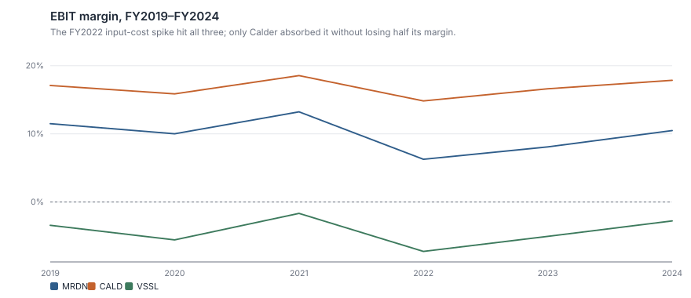
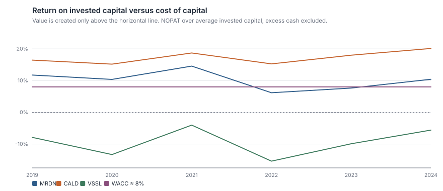
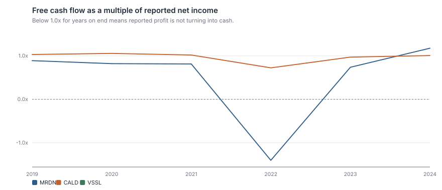
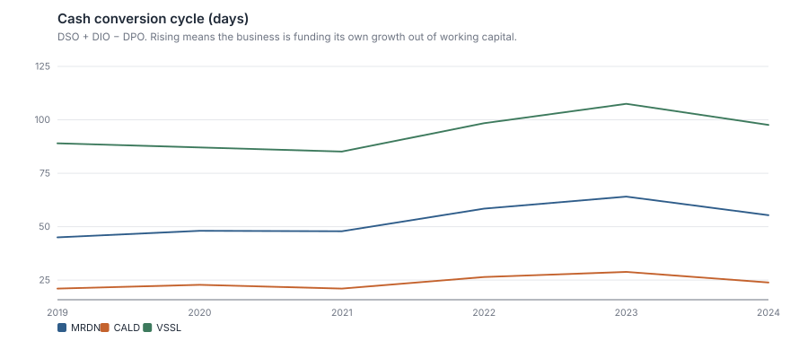
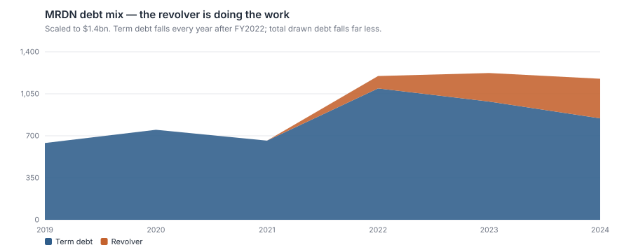
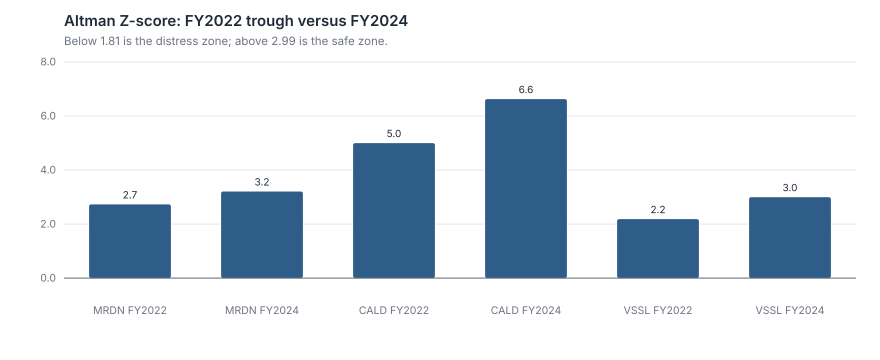

# Financial Statement Analysis — Three Beverage Companies

**Three companies in one industry survived the same cost shock. Which of them is actually a good business, and how would you know from the statements alone?**

A full ratio suite over six years (FY2019–FY2024), five-step DuPont decomposition,
cash-conversion and earnings-quality forensics, Altman Z-scores, and a leverage
investigation that contradicts one company's headline deleveraging story. Standard-library
Python, one command.

```bash
python analysis.py        # writes outputs/results.md and six figures
python -m unittest discover tests -v
```

> **Data notice.** MRDN, CALD and VSSL are **fictional companies** whose accounts are
> generated from explicit operating drivers and validated to articulate — the balance
> sheet ties to the cent and the cash flow statement reconciles to closing cash, every
> year. See [`data/README.md`](data/README.md). The method transfers to real filings by
> replacing one file.

---

## 1. The question

Between FY2019 and FY2024 the non-alcoholic beverage sector absorbed a severe input-cost
shock in FY2022. All three companies here took the hit. Their subsequent paths diverged
completely:

| | MRDN Meridian | CALD Calder | VSSL Vessel |
| :--- | ---: | ---: | ---: |
| FY19 → FY24 revenue | $2,293m → $3,226m | $8,908m → $11,086m | $496m → $1,288m |
| Revenue CAGR | 7.1% | 4.5% | **21.0%** |
| FY24 EBIT margin | 10.5% | **17.9%** | −2.8% |
| FY24 ROIC | 10.4% | **20.1%** | −5.6% |
| FY24 cash conversion cycle | 55 days | **24 days** | 98 days |
| FY24 Altman Z | 3.21 | **6.63** | 2.99 |

The fastest-growing company is the worst business. That is the analysis in one line, and
the rest of this document is the evidence — because "fastest grower, worst business" is
a claim you can only make from the statements, never from the headline.

Three specific questions:

1. **Was FY2022 cyclical or structural?** Same shock, three different recoveries.
2. **Does reported profit become cash?** For each of them, and if not, where does it go?
3. **Is Meridian's deleveraging real?** Management reports falling debt. Is it falling?

## 2. Methodology

### 2.1 Two decisions that change the numbers

**Balance-sheet items are averaged, not closing.** Every ratio dividing a flow by a stock
— ROE, ROA, ROIC, asset turnover, DSO/DIO/DPO — uses the average of opening and closing
balances. Using closing balances flatters any company that grew its balance sheet during
the year. Meridian's FY2022 acquisition added $430m of assets late in the year; on
closing balances its FY2022 returns would print materially lower than the business
actually earned, and the entire "how bad was FY2022" question would be answered wrong.

**Meaningless ratios return `n/m`, not a number.** ROE on negative equity, interest
coverage with no debt, EV/EBITDA on near-zero EBITDA — these are not small numbers, they
are non-numbers. `ratios.py` returns `None` and the report prints `n/m`. This matters
more than it sounds: a single 158× multiple silently entering a median is how a
comparison becomes wrong while still looking rigorous.

### 2.2 Ratios computed

| Family | Ratios |
| :--- | :--- |
| Profitability | gross / EBITDA / EBIT / net margin, ROE, ROA, **ROIC**, ROCE |
| Efficiency | asset turnover, fixed-asset turnover, DSO, DIO, DPO, **cash conversion cycle** |
| Liquidity & solvency | current, quick, interest coverage, net debt/EBITDA, debt/equity |
| Earnings quality | CFO/EBITDA, **FCF/net income**, **accrual ratio**, capex/D&A |
| Decomposition | five-step DuPont |
| Distress | Altman Z |
| Capital return | payout ratio, sustainable growth rate |

**ROIC uses NOPAT over average invested capital with excess cash excluded** from both
sides. Leaving cash in makes a cash-rich company look like a poor allocator of capital it
has not deployed. ROIC — not ROE — is the return that says whether the *business* is good,
because ROE can be manufactured with leverage, and one of these three companies has been
manufacturing it.

**The accrual ratio** is (net income − cash from operations) ÷ average total assets. It
measures how much of reported profit is accounting rather than cash. Persistently high
positive values are among the most studied predictors of disappointing future returns
(Sloan, 1996).

## 3. Findings

### 3.1 FY2022 was cyclical for two of them and structural for one



The common-size income statement isolates exactly where Meridian's money went:

| % of revenue | 2019 | 2020 | 2021 | **2022** | 2023 | 2024 |
| :--- | ---: | ---: | ---: | ---: | ---: | ---: |
| Cost of goods sold | −58.8% | −59.6% | −58.2% | **−63.9%** | −62.1% | −60.2% |
| **Gross profit** | 41.2% | 40.4% | 41.8% | **36.1%** | 37.9% | 39.8% |
| SG&A | −23.8% | −24.4% | −23.1% | −24.3% | −23.9% | −23.4% |
| **EBIT** | 11.5% | 10.0% | 13.2% | **6.3%** | 8.1% | 10.5% |
| Net interest | −1.1% | −0.9% | −0.8% | −1.6% | −2.4% | −2.2% |
| **Net income** | 8.0% | 7.0% | 9.5% | **3.5%** | 4.3% | 6.3% |

The entire FY2022 collapse is in cost of goods sold: 570bp of gross margin, with SG&A
essentially unchanged. That is an input-cost event, not an operating-cost problem, and
input costs mean-revert — which they duly did, 370bp of the 570bp by FY2024.

But look at the net-interest row. It doubled from −0.8% to −2.2% of revenue and has
**stayed there**. Meridian recovered its operating margin; it did not recover its net
margin, because the acquisition debt is permanent in a way the cost spike was not. Net
margin is 6.3% against 9.5% in FY2021, and roughly half that gap is interest.

Calder lost 310bp of gross margin in FY2022 and had recovered all but 100bp of it by
FY2024. Vessel lost 400bp, recovered most of it, and is still losing money — because it
was already losing money.

### 3.2 Only one of them earns its cost of capital comfortably



| FY24 ROIC | vs ~8% WACC |
| :--- | :--- |
| CALD 20.1% | +12pp — genuine, durable value creation |
| MRDN 10.4% | +2.4pp — creates value, with no margin for error |
| VSSL −5.6% | destroys capital on every dollar deployed |

Meridian's ROIC was 14.6% in FY2021, fell to 6.2% in FY2022 — *below its cost of capital*
— and has recovered to 10.4%. The acquisition is the reason it has not returned to FY21
levels: $430m of goodwill and intangibles sits in invested capital and has not yet earned
a proportional return. Whether it ever does is the central question about that deal, and
two years of data cannot answer it.

Vessel's growth is the trap. 21% revenue CAGR at a negative ROIC means every incremental
dollar of capital destroys value; growing faster makes it worse, not better. Growth is
only valuable above the cost of capital, and this is what that principle looks like in a
real set of accounts.

### 3.3 Earnings quality: does profit become cash?



Meridian, FY2022: **CFO/EBITDA of 20.3%** against a 70–82% norm, and FCF of −$137m
against $100m of reported net income (−140% conversion). The cash did not vanish — it
went into inventory. DIO rose from 66 to 70 days and kept rising to 77 in FY2023, pushing
the cash conversion cycle from 48 to 64 days.



By FY2024 Meridian has repaired it: DIO back to 72 days, CCC to 55, FCF conversion of
117.5%, and an accrual ratio of −6.0% (strongly negative — cash exceeds reported profit).
That is a clean set of accounts.

Vessel's CCC is 98 days and its FCF has been negative in all six years. A company with a
98-day cycle growing 21% a year is funding its own growth out of a working-capital hole
it has to keep refilling with outside money — and it has: $610m of equity issued across
six years, taking the share count from 62m to 98m. **Revenue grew 21% a year; revenue per
share grew 12%.** A third of the growth went to the people who funded it.

Calder converts more than 100% of net income to free cash flow in four of the six years
and never falls below 72%, which is what a 24-day cash conversion cycle and 20% ROIC look
like from the cash flow statement.

### 3.4 Meridian's deleveraging is half presentational

This is the finding I would lead with in front of a portfolio manager.

| FY | Term debt | Revolver | **Total debt** | Net debt | ND/EBITDA | FCF | Dividends + buybacks |
| :--- | ---: | ---: | ---: | ---: | ---: | ---: | ---: |
| 2021 | 660 | 0 | **660** | 403 | 0.90× | 197 | 184 |
| 2022 | 1,095 | 103 | **1,198** | 1,074 | 3.70× | −137 | 103 |
| 2023 | 985 | 239 | **1,224** | 1,085 | 2.77× | 98 | 109 |
| 2024 | 845 | 330 | **1,175** | 1,030 | 2.13× | 239 | 185 |



Term debt fell $250m from FY2022 to FY2024 — the number that gets quoted. Total drawn
debt fell **$23m**. The revolver rose from $103m to $330m over the same period, and it
rose in every year that dividends plus buybacks exceeded free cash flow. In FY2024
Meridian generated $239m of free cash flow, returned $185m to shareholders including a
$70m buyback, repaid $140m of term debt, and drew $91m more on the revolver to square it.

Net debt/EBITDA genuinely improved, from 3.70× to 2.13× — but hold net debt at its FY2022
level and apply FY2024 EBITDA and the ratio is 2.22×. Almost the entire improvement is the
EBITDA denominator recovering, not the debt numerator falling. The
FY2022 payout ratio of 105.6% (a dividend paid out of a balance sheet, not out of
earnings) is the same instinct showing up a year earlier.

None of this is fraud or even unusual. It is a management team protecting a dividend
record through a rough patch. But "we have repaid $250m of debt" and "we have reduced our
indebtedness" are different claims, and only the first one is true.

### 3.5 Distress scores



| | FY2021 | FY2022 | FY2024 | Zone in FY2024 |
| :--- | ---: | ---: | ---: | :--- |
| MRDN | 4.57 | 2.73 | 3.21 | safe (grey in FY22–23) |
| CALD | 5.80 | 5.00 | 6.63 | safe throughout |
| VSSL | 5.27 | 2.18 | 2.99 | grey, and grey since FY22 |

Two cautions on reading these. Vessel's FY2021 score of 5.27 was never a statement about
its solvency: 0.6 × (market cap ÷ total liabilities) is a full term of the model, and the
stock was trading at $31. When it fell to $11 in FY2022 the Z-score collapsed to 2.18
while the operating terms barely moved. Its subsequent recovery to 2.99 is likewise mostly
the share price. Second, Meridian passed through the grey zone in FY2022–23 and is back
in the safe zone — but crossing 2.99 is not an event, it is a threshold from a 1968
discriminant fitted on manufacturers. A Z-score is a screen that tells you where to look,
not a conclusion.

## 4. Conclusion

**Calder is the only unambiguously good business here.** 20.1% ROIC, a 24-day cash
conversion cycle, 100%+ cash conversion, 0.7× net debt/EBITDA, and it absorbed the FY2022
shock without breaking stride. It grows slowest and it deserves its premium multiple.

**Meridian is a decent business carrying a debt-funded mistake.** The operating recovery
is real and visible in the gross margin line. The FY2024 accounts are clean — 117% FCF
conversion, a −6.0% accrual ratio. But ROIC has not returned to FY2021 levels because of
the acquisition, interest permanently costs 140bp of net margin, and the deleveraging
story does not survive looking at the revolver. Improving, not repaired.

**Vessel is growth that costs more than it returns.** 21% revenue CAGR, negative ROIC in
every year, negative free cash flow in every year, a 98-day cash conversion cycle, and a
58% increase in share count to pay for it. There is no operating leverage arriving:
gross margin in FY2024 (34.9%) is below FY2019 (35.2%) despite 2.6× the revenue. If scale
were going to fix this business, it would have started by now.

**If forced to own one: Calder, on quality. If forced to rank on
risk-adjusted opportunity: Meridian, because the FY22 damage is visibly reversing while
the price still reflects it — which is the argument made in
[the DCF project](../equity-valuation-dcf/).**

## Limitations

1. **The companies are fictional.** The method, code and reasoning are real; the issuers
   are not. See `data/README.md` for why this trade was made and how to point the analysis
   at a real 10-K.
2. **Six years is one cycle at most.** FY2019–FY2024 contains a single cost shock. Any
   claim about "durability" from six observations is a claim about one event.
3. **FY2019 ratios use closing balances for their opening figures** — there is no FY2018
   balance sheet in the file. FY2019 return ratios are therefore very slightly
   inconsistent with FY2020–24 and should not be compared too finely.
4. **No segment data, no geography, no volume/price split.** The most important question
   about Meridian's margin recovery — how much is price and how much is mix — cannot be
   answered from consolidated statements. In a real analysis this is where the 10-K's MD&A
   and segment note would carry the argument.
5. **Altman Z is calibrated on 1960s US manufacturers.** It is used here as a screen,
   with its market-cap sensitivity called out explicitly. It should not be read as a
   probability of anything.
6. **No lease capitalisation, pension adjustment, or share-based-compensation add-back.**
   Each would move ROIC and leverage for real companies; none exist in these accounts.
7. **No audit-level scrutiny.** The accrual ratio and cash conversion checks here are
   screens for earnings quality. A real forensic review would test revenue recognition
   policy, related-party transactions, and changes in accounting estimates — none of
   which live in the numbers.

## Repository layout

```
analysis.py              one command, reproduces everything
src/ratios.py            ratio engine, DuPont, common-size, Altman Z
src/finlib.py            shared statistics and SVG charting toolkit
data/financials.json     fictional three-statement history (see data/README.md)
outputs/                 generated tables and figures — safe to delete and rebuild
tests/                   unit tests: ratio identities, DuPont reconciliation, data integrity
```

## References

Penman, *Financial Statement Analysis and Security Valuation* — common-size analysis and
the reformulation of statements for valuation.
Sloan (1996), "Do stock prices fully reflect information in accruals and cash flows about
future earnings?" — the accrual anomaly.
Altman (1968), "Financial ratios, discriminant analysis and the prediction of corporate
bankruptcy."
