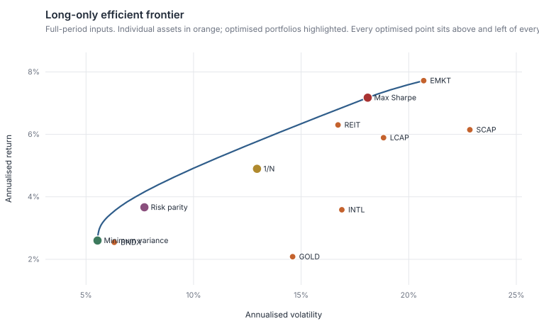
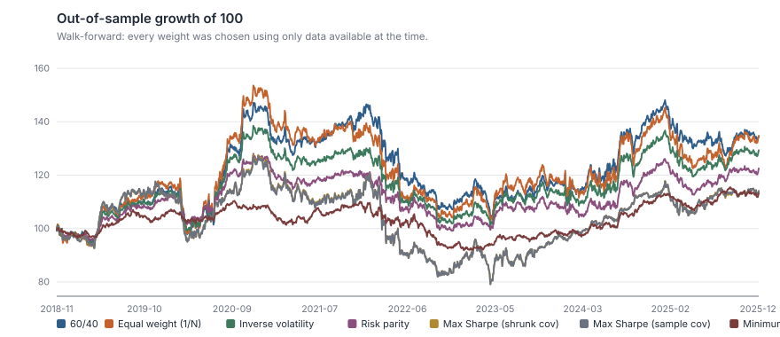
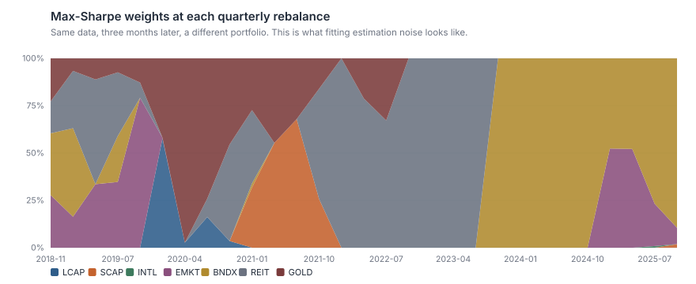
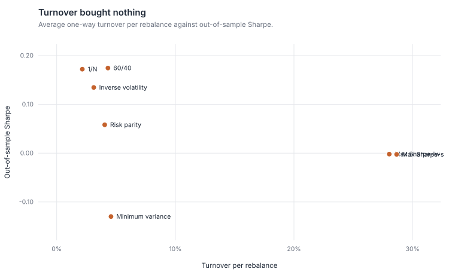

# Portfolio Optimizer — Does Optimisation Beat 1/N?

**Seven construction rules, tested out of sample. Equal weight won. The mean-variance optimiser finished last, with fifteen times the turnover and a worse drawdown.**

A long-only mean-variance optimiser built from scratch — simplex projection, projected
gradient descent, Ledoit–Wolf covariance shrinkage, risk parity — and then, more
importantly, a walk-forward test that only ever lets each rule see data it would actually
have had.

```bash
python analysis.py        # ~30 seconds; writes outputs/results.md and six figures
python -m unittest discover tests -v
```

> **Data notice.** The price history is a **simulation** (factor model, GARCH volatility,
> fat tails, planted regimes). See [`data/README.md`](data/README.md), and
> [`fetch_real_prices.py`](fetch_real_prices.py) to point the same pipeline at real Stooq
> data. Conclusions about *method* transfer; conclusions about *markets* do not, and this
> write-up keeps the two apart.

---

## 1. The question

Markowitz's mean-variance optimisation is the foundation of modern portfolio theory and it
is, in practice, notoriously bad. DeMiguel, Garlappi and Uppal (2009) tested fourteen
optimisation models against naive 1/N across seven datasets, and none of the fourteen beat
it consistently.

So the question is not "what is the optimal portfolio" — the maths for that is settled and
implemented in `src/optimizer.py`. The question is:

**Which construction rules survive out of sample, and why do the sophisticated ones fail?**

Seven candidates:

| Rule | Needs expected returns? | Needs a covariance matrix? |
| :--- | :---: | :---: |
| Equal weight (1/N) | no | no |
| 60/40 | no | no |
| Inverse volatility | no | variances only |
| Risk parity | no | yes |
| Minimum variance | no | yes |
| Max Sharpe (sample covariance) | **yes** | yes |
| Max Sharpe (Ledoit–Wolf shrunk) | **yes** | yes |

That column ordering turns out to be the answer.

## 2. Methodology

### 2.1 Every solver is built on one primitive

All optimisers are long-only and fully invested — weights live on the simplex
{w : Σw = 1, w ≥ 0} — because that is the constraint set a real mandate has, and because
unconstrained mean-variance is where the "error maximiser" reputation comes from: with no
constraints it takes a 400% position in whatever asset has the highest *estimated* mean
and funds it by shorting the rest.

The constraint is enforced by **exact Euclidean projection onto the simplex** (Duchi et
al., 2008): sort descending, find the threshold that keeps the shifted vector positive,
subtract, clip. Not clip-and-renormalise — that is not a projection, and it can leave the
solution off the true optimum.

```
project_to_simplex(v)   →  the closest point to v satisfying Σw = 1, w ≥ 0
min_variance(Σ)         →  projected gradient descent on w'Σw
max_utility(μ, Σ, λ)    →  projected gradient ascent on w'μ − (λ/2)w'Σw
risk_parity(Σ)          →  fixed-point iteration equalising w_i(Σw)_i
```

**The efficient frontier is traced by sweeping λ**, not by solving a constrained problem
per target return. The two are equivalent, and the sweep can never be handed an infeasible
target. The tangency portfolio is then the frontier point with the highest Sharpe ratio —
which is also why it cannot blow up: the closed-form solution requires inverting Σ and
permits shorts, and on a long-only mandate it is simply the wrong answer.

### 2.2 Ledoit–Wolf shrinkage

The sample covariance matrix is unbiased but noisy, and mean-variance optimisation
concentrates weight on exactly its smallest eigenvalues — the noisiest part. Shrinking
toward a structured target trades a little bias for a large variance reduction, and
Ledoit–Wolf (2004) estimates the optimal trade-off from the data:

```
F     = (trace(S)/n)·I                                   the target
δ²    = ‖S − F‖²_F / n                                    dispersion of S from F
β²    = (1/T²)·Σ_t ‖x_t x_t' − S‖²_F / n                  estimation error in S
ρ     = min(β²/δ², 1)                                     shrinkage intensity
Σ̂     = ρF + (1 − ρ)S
```

### 2.3 The walk-forward test

This is the part that matters. At each quarter-end the estimator sees **only the trailing
three years**; the resulting weights are held through the next quarter, drifting with
performance; 5bp of one-way cost is charged on turnover. 7.3 years of out-of-sample track
record, 2018-11 to 2025-12.

An optimiser evaluated on the data it was fitted to is not being evaluated. To make the
size of that error visible, the report also includes a **look-ahead portfolio**: the
max-Sharpe weights computed from the *entire* sample and then "tested" over part of it.
It is cheating on purpose, and the gap between it and the honest rows is the size of the
lie a look-ahead backtest tells.

## 3. Results

### 3.1 The frontier looks convincing



In-sample, the max-Sharpe portfolio earns 7.18% at 18.1% volatility for a Sharpe of 0.26,
against 1/N's 4.90% at 12.95% for 0.19 — a third more risk-adjusted return, apparently for
free. It puts 62% in emerging markets and 38% in listed real estate, and nothing in the
other five sleeves.

It is not free, and that concentration is the tell. The chart is fitted to the answer.

### 3.2 Out of sample, the ranking inverts

| Rule | CAGR | Volatility | Sharpe | Max DD | Turnover per rebalance |
| :--- | ---: | ---: | ---: | ---: | ---: |
| **Equal weight (1/N)** | **4.15%** | 14.04% | **0.17** | −33.6% | **2.2%** |
| 60/40 | 4.12% | 12.73% | 0.17 | −29.6% | 4.3% |
| Inverse volatility | 3.57% | 10.89% | 0.13 | −27.3% | 3.1% |
| Risk parity | 2.81% | 8.39% | 0.06 | −22.6% | 4.0% |
| Minimum variance | 1.71% | **5.88%** | −0.13 | **−16.8%** | 4.6% |
| Max Sharpe (sample cov) | 1.81% | 12.68% | −0.00 | −37.7% | **28.7%** |
| Max Sharpe (shrunk cov) | 1.81% | 12.73% | −0.00 | −38.0% | 28.0% |
| *Look-ahead max Sharpe (**not investable**)* | *4.51%* | *19.37%* | *0.19* | *−39.2%* | — |



**The optimiser that maximises Sharpe delivered a Sharpe of zero.** 1.81% a year against
1/N's 4.15%, the deepest drawdown in the study at −37.7%, and 28.7% turnover per quarter
against 2.2%. It paid thirteen times the trading costs to underperform by 234 basis points
a year and take more risk doing it.

Read the table against the "needs expected returns?" column in section 1. The two rules
that estimate **nothing at all** — 1/N and 60/40 — finished first and second on return. The
three that estimate only a covariance matrix landed in the middle, and did so by design:
they take less risk, so they earn less. The two that estimate expected returns produced a
Sharpe of zero while running the largest drawdowns in the study — they took the most risk
and were paid nothing for it.

### 3.3 Why: expected returns cannot be estimated



That chart is the whole explanation. Every three months, on data that overlaps 92% with
the previous window, the max-Sharpe portfolio is a different portfolio. Average weight
churn between consecutive rebalances is 29% — the optimiser is not tracking a changing
world, it is chasing estimation noise in the trailing mean.

The reason is a well-known asymmetry: volatility can be estimated from high-frequency data
with reasonable precision, but the standard error of a mean return scales with σ/√T and
does not care how often you sample. For a 20%-volatility asset, three years of daily data
gives a standard error on the annual mean of about **11.5 percentage points**. The
optimiser treats a 6% estimate and a 9% estimate as different facts. They are the same
noise.

Minimum variance and risk parity use only the covariance matrix — the input that *can* be
estimated — and their weights are correspondingly stable at 4% churn.

### 3.4 Two honest caveats about that table

**Sharpe rankings invert when excess returns go negative.** The average risk-free rate over
the test window was 2.63%, and minimum variance returned 1.71% — a negative excess return.
When the numerator is negative, *dividing by less volatility makes the ratio worse*. Min
variance ranks last on Sharpe at −0.13 partly **because** it succeeded at reducing
volatility. Judged on what it was built to do, it delivered the lowest volatility (5.88%)
and much the shallowest drawdown (−16.8%) in the study, and the Sharpe ranking is actively
misleading about it. This is why the
table above leads with CAGR, volatility and drawdown, and why a single ratio should never
be the sole ranking criterion.

**Shrinkage did nothing here, and that is a real result.**

| Window | Observations per asset | Shrinkage intensity | Condition number |
| ---: | ---: | ---: | ---: |
| 126 days | 18 | 4.1% | 77 |
| 252 days | 36 | 4.4% | 101 |
| 756 days | **108** | **1.1%** | 107 |
| 2,607 days | 372 | 0.4% | 170 |

Ledoit–Wolf chose an intensity of 1.1% at the three-year window — it looked at the data and
concluded there was almost nothing to shrink. With seven assets and 756 observations, the
sample covariance matrix is well determined. Shrinkage is a fix for a hard estimation
problem, and **seven assets is not a hard estimation problem**; it earns its reputation at
50 or 500 assets, where T/n falls toward 1 and the matrix becomes near-singular. Reporting
that it did not help — rather than quietly dropping the comparison — is the finding.

### 3.5 The most damning number

The look-ahead portfolio — the one that knew the future — achieved a Sharpe of **0.19**.
Equal weight achieved **0.17**.

Perfect foresight about the optimal fixed weights was worth two basis points of Sharpe, and
it bought them with 19.4% volatility against 1/N's 14.0% and a deeper drawdown (−39.2%
against −33.6%). Whatever the max-Sharpe optimiser was chasing at 28.7% quarterly turnover,
**it was barely there to be found even with hindsight.** That is the strongest argument in this project for 1/N: not that
optimisation is hard, but that in a well-diversified seven-asset universe the prize for
getting it right is very small, and the cost of getting it wrong is not.



## 4. Conclusion

1. **Use 1/N or a risk-based rule.** Equal weight beat every optimiser out of sample, at
   1/13th the turnover. Risk parity and minimum variance did what they promised on risk —
   the lowest volatility and shallowest drawdowns in the study — and are the right choice
   if risk, not return, is the objective.
2. **Never let an optimiser estimate expected returns from a trailing mean.** The standard
   error is larger than the differences the optimiser is acting on. If you must use views,
   they should come from somewhere other than the recent past (Black–Litterman exists for
   exactly this reason).
3. **Shrinkage is a tool for a specific problem.** It fixes ill-conditioned covariance
   matrices. Seven assets and three years of data do not produce one, and the estimator
   correctly said so.
4. **Report the look-ahead bound.** It cost twenty lines of code and it reframed the entire
   study: the achievable prize was two basis points of Sharpe.

## Limitations

1. **Simulated data.** No conclusion about real markets follows. The method, the solvers
   and the walk-forward design transfer; the numbers do not.
2. **One test period.** 7.3 years, one path. The ranking is consistent with the published
   literature on real data, which is reassuring, but this study alone cannot establish it.
3. **Seven assets is a small universe** — and, as section 3.4 shows, small enough that the
   estimation problem shrinkage is designed for barely exists. A 50-asset equity universe
   would likely reverse the shrinkage conclusion, and that is the obvious next experiment.
4. **No Black–Litterman, no resampled frontier, no robust optimisation.** These are the
   standard responses to exactly the failure documented here, and omitting them means this
   study shows that naive mean-variance fails, not that all optimisation does.
5. **Costs are 5bp flat on turnover.** The max-Sharpe rule's 28.7% quarterly turnover would
   in reality face wider spreads, market impact and — for a taxable investor — realised
   capital gains, all of which make its result worse than shown.
6. **Projected gradient descent is not a QP solver.** It converges on these convex problems
   (tested), but a production system would use a proper quadratic programming library with
   exact optimality certificates rather than a fixed iteration budget.
7. **The risk-free rate inside the optimiser is a constant 2.5%**, while the performance
   statistics use the actual daily path. A minor inconsistency, but a real one.

## Repository layout

```
analysis.py               one command, reproduces everything (~30s)
src/optimizer.py          simplex projection, frontier, min-var, max-Sharpe, risk parity,
                          Ledoit-Wolf shrinkage, condition number
src/walkforward.py        out-of-sample engine: estimate, hold, drift, measure
src/finlib.py             shared statistics and SVG charting toolkit
data/prices_daily.csv     simulated price panel (see data/README.md)
fetch_real_prices.py      download real history from Stooq in the same CSV layout
outputs/                  generated tables and figures — safe to delete and rebuild
tests/                    projection correctness, optimality checks, no-look-ahead assertions
```

## References

Markowitz (1952), "Portfolio Selection."
DeMiguel, Garlappi & Uppal (2009), "Optimal versus naive diversification: how inefficient
is the 1/N portfolio strategy?"
Ledoit & Wolf (2004), "A well-conditioned estimator for large-dimensional covariance
matrices."
Duchi, Shalev-Shwartz, Singer & Chandra (2008), "Efficient projections onto the L1-ball for
learning in high dimensions."
Maillard, Roncalli & Teiletche (2010), "The properties of equally weighted risk
contribution portfolios."
