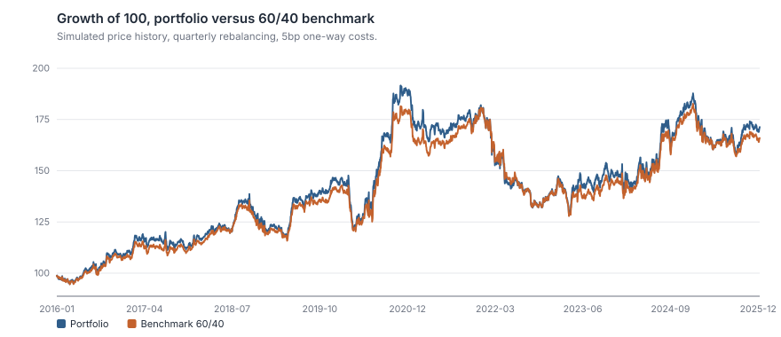
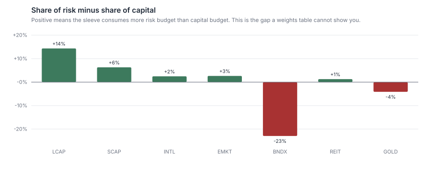
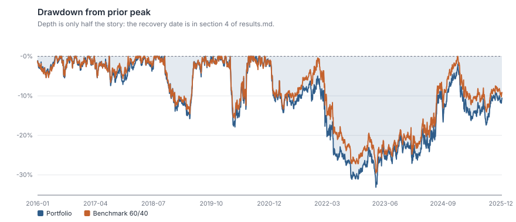
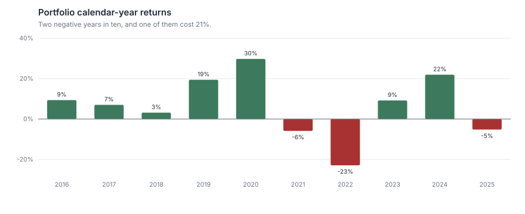
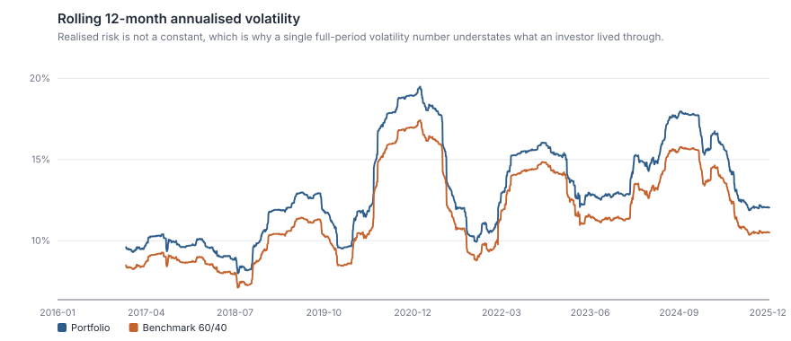
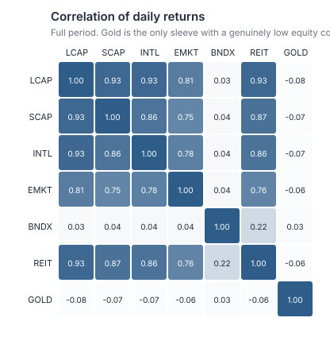

# Portfolio Performance & Risk Analytics

**A seven-sleeve diversified portfolio beat the 60/40 by 32 basis points a year. Was it worth it?**

Ten years of daily data, a drift-and-rebalance backtest with explicit turnover and trading
costs, and full performance and risk attribution — including the number that a weights
table cannot show you: **25% of the capital sits in bonds and contributes 2% of the risk.**

```bash
python analysis.py        # writes outputs/results.md and seven figures
python -m unittest discover tests -v
```

> **Data notice.** The price history is a **simulation**, not market data: a factor model
> with GARCH volatility clustering, fat-tailed shocks and planted bear-market regimes.
> Tickers are fictional. See [`data/README.md`](data/README.md) for the generating process
> and [`fetch_real_prices.py`](fetch_real_prices.py) to run the identical pipeline on real
> Stooq history. Every method, statistic and conclusion about *technique* holds; no
> conclusion about *markets* should be drawn from simulated data, and this write-up is
> careful to separate the two.

---

## 1. The question

A balanced mandate holds seven sleeves:

| Sleeve | | Weight | Benchmark |
| :--- | :--- | ---: | ---: |
| LCAP | US large-cap core | 35% | 60% |
| SCAP | US small-cap | 10% | — |
| INTL | Developed ex-US | 12% | — |
| EMKT | Emerging markets | 8% | — |
| BNDX | Aggregate bonds | 25% | 40% |
| REIT | Listed real estate | 6% | — |
| GOLD | Gold | 4% | — |

It is measured against the classic 60/40. Both are rebalanced quarterly with 5bp of
one-way trading cost charged on turnover. The period is 10.3 years, 2,607 trading days.

Three questions:

1. **Did the extra complexity pay?** Five extra sleeves versus two.
2. **Where does the risk actually live?** Not where the capital does.
3. **Does rebalancing earn its costs?**

## 2. Methodology

### 2.1 Rebalancing is simulated, not assumed

Most portfolio code computes `sum(w_i × r_i)` every day. That silently assumes the
portfolio is rebalanced back to target continuously and for free — which nobody does, and
which quietly manufactures a rebalancing premium the investor never earned.

Here weights **drift with performance**, are reset only on an explicit calendar
(monthly / quarterly / annual / never), and turnover is measured at each reset:

```
one-way turnover = ½ · Σ |w_drifted − w_target|
cost charged     = turnover × 2 × cost_bps
```

Over 10.3 years, quarterly rebalancing produced 39 rebalances, 0.73× cumulative turnover,
and 0.7bp a year of cost drag. Small — but it is measured rather than ignored, and the
difference between the four policies is only meaningful once costs are in.

### 2.2 Risk contribution, and why it is not weight

Portfolio volatility is homogeneous of degree one in the weights, so by Euler's theorem it
decomposes exactly:

```
MCR_i = w_i · (Σw)_i / σ_p          marginal contribution to risk
PCR_i = MCR_i / σ_p                 share of total portfolio risk, Σ PCR_i = 1
```

This is the single most useful calculation in the project. A sleeve's share of risk
depends on its volatility *and* its covariance with everything else — so a 25% bond
allocation with near-zero equity correlation can consume 2% of the risk budget, and a 4%
gold sleeve can consume less than nothing.

### 2.3 Attribution that actually adds up

Contributions are accumulated on the weights the portfolio **entered each period with**,
compounded through the level of the portfolio:

```
contribution_i = Σ_t  level_{t−1} · w_{i,t} · r_{i,t}
```

The common shortcut — target weight × asset total return — does not sum to the portfolio
return once weights drift, and the residual lands nowhere. The version here sums to the
portfolio's total return to nine decimal places, and there is a unit test asserting it.

### 2.4 Statistics reported

CAGR (geometric, never arithmetic), annualised volatility, Sharpe and Sortino on excess
returns over the actual daily risk-free path, historical VaR and CVaR at 95%, skew and
excess kurtosis, maximum drawdown **with peak, trough, recovery date and length**, beta,
Jensen's alpha, R², tracking error, information ratio, and up/down capture.

Sortino uses the full sample length in its denominator, not just losing days — the
convention that does not silently inflate the ratio.

## 3. Results

### 3.1 The diversified portfolio barely won

| | CAGR | Volatility | Sharpe | Sortino | Max DD | VaR 95% | CVaR 95% |
| :--- | ---: | ---: | ---: | ---: | ---: | ---: | ---: |
| **Portfolio** | 5.34% | 13.16% | 0.30 | 0.41 | −33.14% | 1.18% | 1.96% |
| **Benchmark 60/40** | 5.02% | 11.72% | 0.29 | 0.41 | −29.56% | 1.06% | 1.75% |



+32bp of CAGR, bought with +144bp of volatility and 358bp of extra drawdown. On a
risk-adjusted basis the two are indistinguishable: Sharpe 0.30 against 0.29, and Sortino
0.41 against 0.41.

| Versus benchmark | |
| :--- | ---: |
| Beta | 1.11 |
| Annualised alpha | +0.11% |
| R² | 0.977 |
| Tracking error | 2.36% |
| Information ratio | 0.21 |
| Up capture | 110% |
| Down capture | 110% |

This is the honest reading: **the diversified portfolio is a 1.11-beta version of the
benchmark.** It captures 110% of the upside and 110% of the downside. An R² of 0.977 says
nearly 98% of its variance is just the 60/40 moving. The information ratio of 0.21 is not
statistically distinguishable from zero over ten years — as a rule of thumb an IR of 0.2
needs roughly 25 years of data before you can reject zero at conventional confidence.

### 3.2 The risk lives somewhere else than the capital



| Sleeve | Weight | Share of return | **Share of risk** | Risk ÷ weight |
| :--- | ---: | ---: | ---: | ---: |
| LCAP | 35% | 44% | **49%** | 1.41× |
| SCAP | 10% | 14% | **16%** | 1.63× |
| INTL | 12% | 9% | **14%** | 1.21× |
| EMKT | 8% | 11% | **11%** | 1.33× |
| BNDX | 25% | 13% | **2%** | 0.08× |
| REIT | 6% | 7% | **7%** | 1.21× |
| GOLD | 4% | 2% | **−0%** | −0.03× |

**65% of the capital sits in equities and produces 90% of the risk. 25% sits in bonds and
produces 2%.** An investor looking at the pie chart believes they hold a balanced
portfolio. They hold an equity portfolio with a bond sleeve attached.

Gold's contribution is *negative*: its marginal contribution to portfolio variance is
below zero, because its correlation with every equity sleeve is negative. It added 2% of
the return and removed risk. On this evidence the 4% gold sleeve is the best-behaved line
in the mandate — and the 6% REIT sleeve, at a 0.93 correlation to LCAP, is a large-cap
equity position wearing a different label.

Diversification ratio: **1.20**. The weighted average sleeve volatility is 20% higher than
the portfolio's realised volatility, so diversification is doing real work — just far less
of it than seven line items suggest.

### 3.3 Drawdown: depth is only half the story



| | Worst drawdown | Peak | Trough | Recovered | Length |
| :--- | ---: | :--- | :--- | :--- | ---: |
| Portfolio | −33.14% | 2020-11-24 | 2023-04-17 | **not recovered** | 1,331 days |
| Benchmark | −29.56% | 2020-11-24 | 2023-04-17 | 2025-01-17 | 1,083 days |

Both fell into the same hole. The benchmark climbed out in January 2025 after 1,083
trading days. The portfolio — 3.6 percentage points deeper, and higher beta on the way
back — had still not recovered its November 2020 peak by the end of the sample, more than
four years later.

This is why maximum drawdown alone is a poor risk statistic. A 33% fall that recovers in a
year and a 33% fall that has not recovered in four are not the same experience, and only
the recovery date distinguishes them.

### 3.4 Calendar years



| Year | 2016 | 2017 | 2018 | 2019 | 2020 | 2021 | 2022 | 2023 | 2024 | 2025 |
| :--- | ---: | ---: | ---: | ---: | ---: | ---: | ---: | ---: | ---: | ---: |
| Portfolio | 9.4% | 7.0% | 3.2% | 19.4% | 29.8% | −5.9% | −22.9% | 9.2% | 21.9% | −5.2% |
| Benchmark | 7.9% | 6.7% | 3.8% | 17.0% | 27.4% | −1.2% | −22.9% | 6.9% | 22.2% | −6.4% |
| Difference | +1.5 | +0.3 | −0.6 | +2.4 | +2.3 | **−4.7** | +0.0 | +2.3 | −0.3 | +1.2 |

The diversified portfolio beat the benchmark in six of ten years and tied in a seventh,
which sounds like a strong record until you notice the sizes: its median win is +1.9pp and
its worst year is −4.7pp, larger than its two best wins combined. **A hit rate is not a
return.** This asymmetry is what a 1.11 beta produces — many small wins in rising markets,
occasional large losses when the extra sleeves move against you.

The 2022 dead heat is the more damning result. In the one year both portfolios needed
diversification most, seven sleeves and two sleeves lost precisely the same 22.9%.



Realised 12-month volatility ranged from 8.0% to 19.5% depending on the window — a factor
of 2.4 between the calmest year and the most violent. The full-period figure of 13.16% is
an average of experiences, not a description of any of them.

### 3.5 Rebalancing pays, modestly

| Policy | CAGR | Volatility | Sharpe | Max DD | Rebalances | Turnover | Cost drag p.a. |
| :--- | ---: | ---: | ---: | ---: | ---: | ---: | ---: |
| Monthly | 5.36% | 13.13% | 0.30 | −32.90% | 119 | 1.25× | 0.012% |
| **Quarterly** | 5.34% | 13.16% | 0.30 | −33.14% | 39 | 0.73× | 0.007% |
| Annual | 5.20% | 13.06% | 0.29 | −33.07% | 9 | 0.28× | 0.003% |
| **Never** | 4.96% | 14.03% | 0.26 | −35.79% | 0 | 0.00× | 0.000% |

Rebalancing at any frequency beats never rebalancing: +38bp of CAGR, 87bp less volatility
and 265bp less drawdown for quarterly versus buy-and-hold. But **the gap between monthly
and quarterly is 2bp** — inside the noise, and monthly costs three times the turnover for
it. The decision that matters is *whether* to rebalance, not *how often*.

### 3.6 Correlations



The four equity sleeves correlate 0.75–0.93 with each other, and REIT correlates 0.93 with
LCAP. Bonds sit near zero to equities (0.03–0.04) and gold slightly negative (−0.06 to
−0.08).

**An honest caveat about this specific table:** the simulated equity sleeves are built on a
shared equity factor, so their high mutual correlation is an *input to the simulation*, not
a discovery about markets. What the table legitimately demonstrates is the machinery —
and what the risk decomposition does with a correlation structure like this one, which is
a conclusion about portfolio mathematics rather than about the world.

## 4. Conclusion

1. **The diversification did not pay in this sample.** +32bp of CAGR for +144bp of
   volatility, a deeper drawdown that never recovered, and an information ratio of 0.21
   that ten years cannot distinguish from zero.
2. **The portfolio is not balanced; it is an equity portfolio.** 65% of capital in
   equities generating 90% of risk, and a 25% bond sleeve contributing 2%. Anyone managing
   this mandate to a risk target is managing the equity sleeves and nothing else.
3. **Two sleeves earn their place, for opposite reasons.** Gold contributes negative risk.
   REIT, at 0.93 correlation to large-cap equity, is a large-cap equity position with an
   extra fee.
4. **Rebalance quarterly and stop optimising it.** Whether to rebalance is worth 38bp;
   how often is worth 2bp.

If this were real data, the actionable conclusion would be to cut REIT, keep gold, and
either accept the equity risk explicitly or raise the bond weight far beyond 25% —
because 25% of capital buying 2% of risk is not a hedge, it is a rounding error with a
custody fee.

## Limitations

1. **The data is simulated.** This is the limitation everything else is subordinate to. No
   statement about real asset behaviour follows from these results. What does transfer is
   the method, the code, and the mathematics of risk decomposition.
2. **One path, one regime sequence.** A single ten-year sample — simulated or real — is
   one draw. The drawdown statistics in particular are dominated by one event.
3. **Risk contributions use full-period covariance.** Correlations move, and they move
   most in exactly the stress periods where the decomposition matters most. A rolling or
   regime-conditional covariance would tell a different and less comfortable story.
4. **Costs are a flat 5bp on turnover.** Real costs include bid-ask spread that widens in
   stress, market impact that scales with size, and taxes — which for a taxable investor
   would likely swamp the entire 38bp rebalancing premium.
5. **No cash flows.** Real portfolios take contributions and withdrawals, which change
   both the return calculation (time-weighted versus money-weighted) and the rebalancing
   analysis, since flows rebalance for free.
6. **Beta and alpha assume a stable linear relationship** to the benchmark across ten
   years spanning several regimes. The 0.977 R² makes the linearity defensible here;
   it would not always be.
7. **No factor decomposition.** Beta versus a 60/40 says how much market risk there is,
   not what kind. Attributing to size, value, duration and credit would be the next step.

## Repository layout

```
analysis.py              one command, reproduces everything
src/portfolio.py         backtest, performance summary, risk and return attribution
src/finlib.py            shared statistics and SVG charting toolkit
data/prices_daily.csv    simulated price panel (see data/README.md)
fetch_real_prices.py     download real history from Stooq in the same CSV layout
outputs/                 generated tables and figures — safe to delete and rebuild
tests/                   attribution additivity, Euler decomposition, drawdown edge cases
```

## References

Bacon, *Practical Portfolio Performance Measurement and Attribution* — attribution
methodology and the arithmetic of contribution.
Roncalli, *Introduction to Risk Parity and Budgeting* — Euler decomposition of portfolio
risk.
Sortino & Price (1994) — downside risk measurement and the denominator convention.
