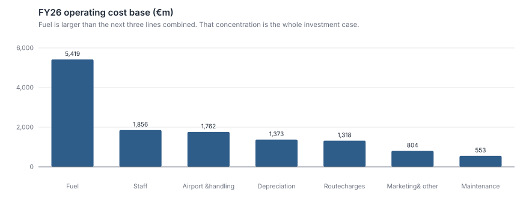
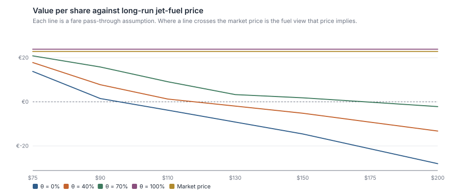
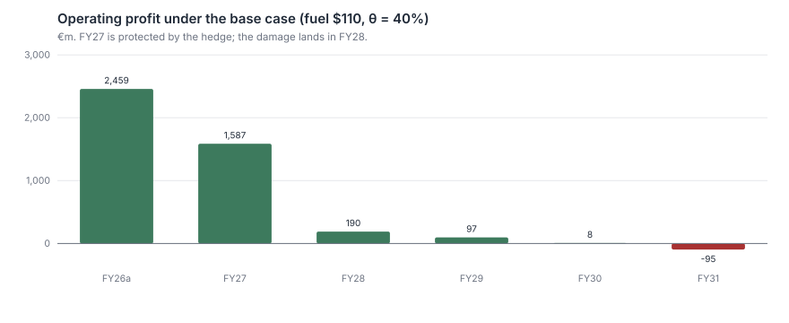

# Ryanair — What Fuel Price Is In The Share Price?

**Ryanair just reported record profits, went effectively debt-free, and trades on 11× earnings. That cheapness is not an opportunity — it is the market pricing a fuel hedge that expires in April 2027.**

A valuation of Ryanair Holdings plc (RYA.IR) built from the FY26 results release, structured
around the only two variables that matter for this equity: the jet-fuel price once the hedge
rolls off, and how much of a fuel increase can be recovered in fares.

```bash
python analysis.py        # writes outputs/results.md and four figures
python -m unittest discover tests -v
```

> **Data notice.** Unlike the other projects in this portfolio, **this one uses real data.**
> Financials are transcribed from
> [Ryanair's FY26 results release](https://investor.ryanair.com/wp-content/uploads/2026/05/FY26-Ryanair-Results.pdf)
> (published 18 May 2026), which the issuer labels *preliminary and unaudited*. The share
> price of €22.845 is the Euronext Dublin quote on 2 September 2026, cross-checked against
> the Nasdaq ADR market capitalisation. Every figure in `data/ryanair_fy26.json` is traceable
> to that document. **This is not investment advice.**

---

## 1. The question

FY26 (year to 31 March 2026) was the best year in Ryanair's history:

| €m | FY26 | FY25 | Change |
| :--- | ---: | ---: | ---: |
| Total revenue | 15,544.3 | 13,948.5 | +11.4% |
| Fuel and oil | 5,418.6 | 5,220.2 | +3.8% |
| Operating profit (pre-exceptional) | 2,459.2 | 1,558.0 | +57.8% |
| Profit after tax | 2,173.7 | 1,611.6 | +34.9% |
| Diluted EPS | €2.0422 | €1.4549 | +40.4% |

208.4m passengers, a 94% load factor, net **cash** of €2.1bn, and a BBB+ rating. The company
states it will repay its last €1.2bn bond and be effectively debt-free.

And the shares trade at **€22.85 — 11.2× trailing earnings, 9.0× EV/EBIT.**

A company that just grew earnings 40%, carries no net debt and returns nearly €1bn a year to
shareholders does not trade at 11× because the market has overlooked it. So the question is
not "is this cheap?" It is:

> **What has to be true for €22.85 to be the right price — and does the market already know
> something the headline numbers do not show?**

## 2. Why this is a fuel question and nothing else



Fuel is €5,418.6m — **larger than the next three cost lines combined**, 41.4% of the cost
base and 34.9% of revenue.

Per passenger, FY26 looks like this:

| Per passenger | € |
| :--- | ---: |
| Revenue | 74.59 |
| Fuel | 26.00 |
| All other operating cost | 36.79 |
| **Operating profit** | **11.80** |

That is an 11.80 euro profit sitting on top of a 26.00 euro fuel bill. Therefore:

> **A 45.4% rise in the fuel bill erases every euro of operating profit**, if none of it is
> recovered in fares.

Now the disclosure that makes this urgent. From page 1 of the release:

- The Strait of Hormuz is closed and jet-fuel spot has **spiked above $150/bbl**
- Ryanair is **80% hedged at approximately $67/bbl — but only to April 2027**

Spot is **124% above the hedge price.** FY27 earnings are protected. FY28 is not.

## 3. Methodology

The model has exactly two live variables, because everything else is noise next to them:

| | |
| :--- | :--- |
| **S** | the long-run jet-fuel price once the hedge rolls off |
| **θ** | the share of a fuel cost increase recovered through higher fares |

```
fuel cost per pax   = FY26 fuel/pax × (effective fuel price ÷ FY26 baseline)
revenue per pax     = FY26 revenue/pax + ancillary growth + θ × (fuel/pax increase)
FCFF                = EBIT × (1 − t) + D&A − capex − ΔNWC
```

FY27 prices 80% at the $67 hedge and 20% at spot; from FY28 the model is fully exposed to S.
Five explicit years, mid-year discounting, Gordon terminal value.

**WACC of 8.55%.** Ryanair holds net cash, so the WACC collapses to the cost of equity:
2.8% risk-free + 1.15 beta × 5.0% ERP. The net-cash bridge **adds** €2.1bn to enterprise
value rather than subtracting — a sign convention worth €2 per share and easy to get backwards.

**One modelling decision worth flagging**, because getting it wrong invalidates the whole
grid. Depreciation and working capital are driven **per passenger**, not as a percentage of
revenue. Model them off revenue and a pure fuel pass-through inflates revenue, which inflates
the D&A add-back and the working-capital release, and the full-pass-through column starts
*rising* with the fuel price. That is an artefact. The corrected model produces a flat
θ = 100% column — which is the right answer, and a useful check that the model works:
**if you recover every euro of fuel, the fuel price cannot affect value.**

## 4. Results

### 4.1 The grid



Value per share (€), against a market price of **€22.85**:

| Long-run fuel | θ = 0% | θ = 40% | θ = 70% | θ = 100% |
| :--- | ---: | ---: | ---: | ---: |
| Normalisation ($75) | 13.80 | 17.83 | 20.84 | **23.86** |
| Elevated ($110) | −3.78 | 1.27 | 9.11 | **23.86** |
| Spot persists ($150) | −14.56 | −5.17 | 1.83 | **23.86** |
| Escalation ($200) | −28.03 | −13.25 | −2.17 | **23.86** |

Read the corners. Full pass-through is worth €23.86 whatever fuel does. Zero pass-through at
today's spot price is worth **less than nothing**.

### 4.2 The finding

The market price of €22.85 is **96% of the θ = 100% value** — the value you get only if
Ryanair recovers *every euro* of any fuel increase in fares.

Equivalently, solving the DCF backwards for the fuel price that justifies today's price:

| Pass-through θ | Implied long-run fuel | EBIT breakeven fuel |
| :--- | ---: | ---: |
| 0% | $67/bbl | $92/bbl |
| 40% | $68/bbl | $108/bbl |
| 70% | $69/bbl | $150/bbl |
| 100% | no solution | never |

> **At €22.85 you are assuming either that fuel returns to roughly $68 — its FY26 level — or
> that Ryanair passes essentially 100% of any increase into fares. Spot is $150.**

Both are possible. Neither is conservative. And the two are not independent: fuel stays high
*because* supply is disrupted, which is also when competitors fail and pricing power appears —
so the bull case is coherent. It is just not the base case, and it is what you are paying for.

### 4.3 Where the damage lands



FY27 is fine — the hedge holds. The collapse is FY28, which is exactly why the market can
look at record FY26 results, hear "debt-free", and still only pay 11× earnings.

### 4.4 Is the answer just my assumption?

The release does not disclose the FY26 realised fuel price, and every scenario scales off it.
So the reverse DCF is re-solved across a range of baselines:

| Assumed FY26 fuel | Implied long-run price | Implied ÷ baseline | Value at $150 (θ=40%) |
| ---: | ---: | ---: | ---: |
| $67 | $68 | 1.01× | −€5.17 |
| $75 | $76 | 1.02× | −€2.22 |
| $85 | $87 | 1.02× | €0.68 |
| $95 | $98 | 1.03× | €2.88 |

The implied *level* moves with the assumption, as it must. The implied price **as a ratio to
the baseline does not** — it sits at 1.01–1.03× throughout.

> **Stated so it does not depend on the weak assumption: the market is pricing long-run fuel
> within about 3% of whatever FY26 was struck at.** It is pricing the spike as fully temporary.

### 4.5 A discrepancy in the source document

The release quotes the FY27 hedge two ways:

- Highlights: `FY27 jet-fuel 80% hedged @ $668 met. tn`
- Narrative: `80% of FY27 jet-fuel is hedged at approx. $67bbl`

At the standard ~7.9 barrels per metric tonne, $668/tonne is **$84.6/bbl**, not $67/bbl. The
two disclosures do not reconcile. The model works in $/bbl, because spot is also quoted per
barrel, and §4.4 spans both readings — but anyone taking this further should resolve it
against the annual report's fuel note before quoting a level.

## 5. Conclusion

**Ryanair is not cheap. It is priced for a benign fuel outcome, and the option on that
outcome expires in April 2027.**

The 11× multiple is not the market missing a great business — it is the market correctly
identifying that FY26's record profit was earned under a hedge that is about to roll off into
a fuel price 124% higher.

The asymmetry is what decides it:

- **If fuel normalises to $75** and pass-through is a realistic 40–70%: €17.83–€20.84.
  *Still below the current price.*
- **If fuel stays at $150** and pass-through is 40%: **−€5.17.** The equity is impaired.
- **To justify €22.85** you need close to full pass-through, sustained.

You are being asked to pay a price that already assumes the good outcome, to take the risk of
the bad one. **Avoid.**

**What would change this view:** evidence on pass-through. Ryanair has the lowest cost base in
Europe, and a sustained fuel spike bankrupts weaker competitors, removes capacity and hands
Ryanair pricing power — that is the mechanism by which θ approaches 1. The FY27 H1 results,
showing fares against a rising unit fuel cost, are the test. A demonstrated pass-through above
70% makes this a very different investment.

## Limitations

1. **Preliminary and unaudited figures.** The issuer's own label. The annual report may restate.
2. **The FY26 realised fuel price is not disclosed**, and the model scales off it. §4.4 exists
   precisely because this is the weakest link, and reframes the conclusion as a ratio to survive it.
3. **The source document contradicts itself on the hedge price** ($668/tonne vs $67/bbl). Unresolved.
4. **Pass-through is modelled as a single constant.** In reality it is time-varying,
   asymmetric (fares rise faster than they fall), and depends on competitor behaviour that is
   not modelled at all.
5. **No capacity response.** A sustained fuel spike would change fleet plans, route closures
   and the whole industry structure. The model holds traffic growth fixed across every fuel scenario.
6. **No currency modelling.** Fuel is priced in dollars and revenue is largely in euros; the
   EUR/USD rate is a real second exposure that is ignored here.
7. **Terminal value is a large share of value in the benign scenarios** and zero in the
   loss-making ones, since a Gordon terminal value on negative cash flow is meaningless. The
   model returns zero rather than a nonsense positive number — but that makes the downside
   scenarios' *precise* values less meaningful than their sign.
8. **One analyst, no review, no management access, no channel checks.**

## Repository layout

```
analysis.py                one command, reproduces everything
src/airline.py             fuel path, pass-through, FCFF, reverse DCF, breakeven
src/finlib.py              shared statistics and SVG charting toolkit
data/ryanair_fy26.json     figures transcribed from the FY26 release, with source metadata
data/README.md             provenance, and how to update it from the next filing
outputs/                   generated tables and figures — safe to delete and rebuild
tests/                     model identities, the pass-through invariant, data integrity
```

## Sources

- [Ryanair FY26 Results, 18 May 2026](https://investor.ryanair.com/wp-content/uploads/2026/05/FY26-Ryanair-Results.pdf) — primary source for all financials
- [Ryanair Investor Relations](https://investor.ryanair.com/) — for subsequent filings
- Share price: Euronext Dublin, 2 September 2026, cross-checked against the Nasdaq ADR
